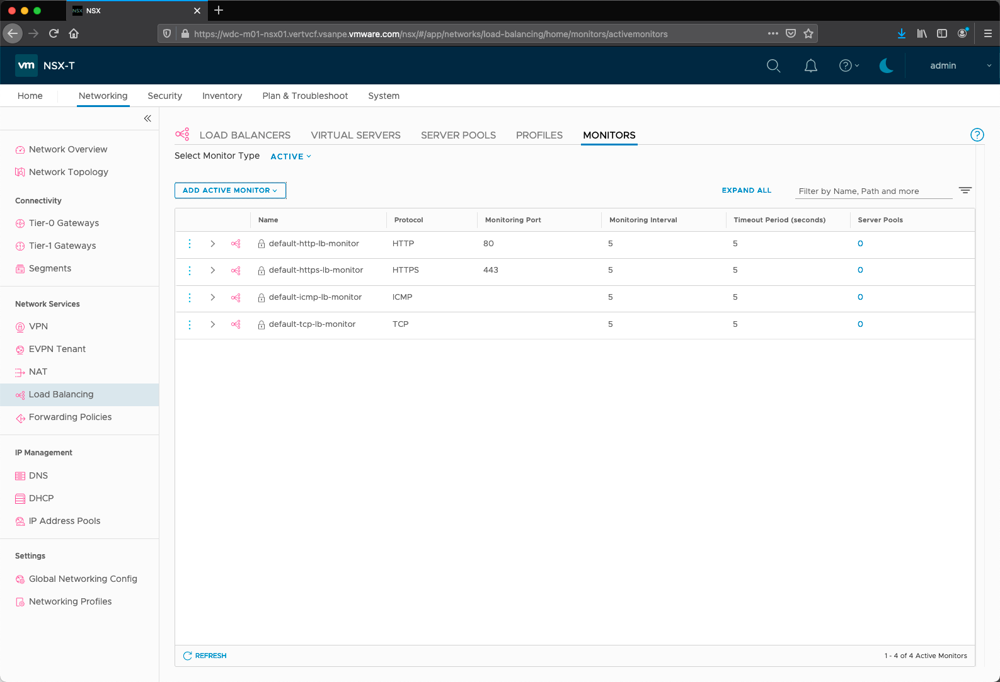
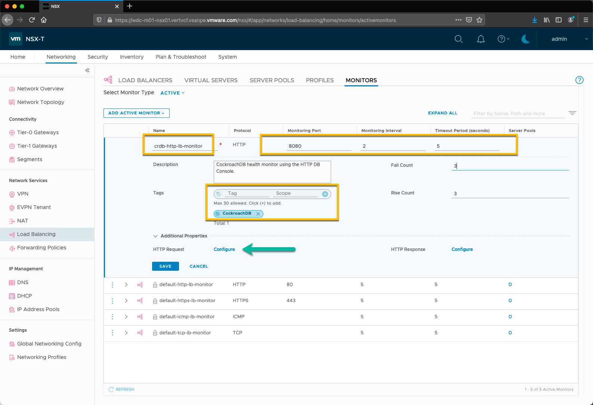
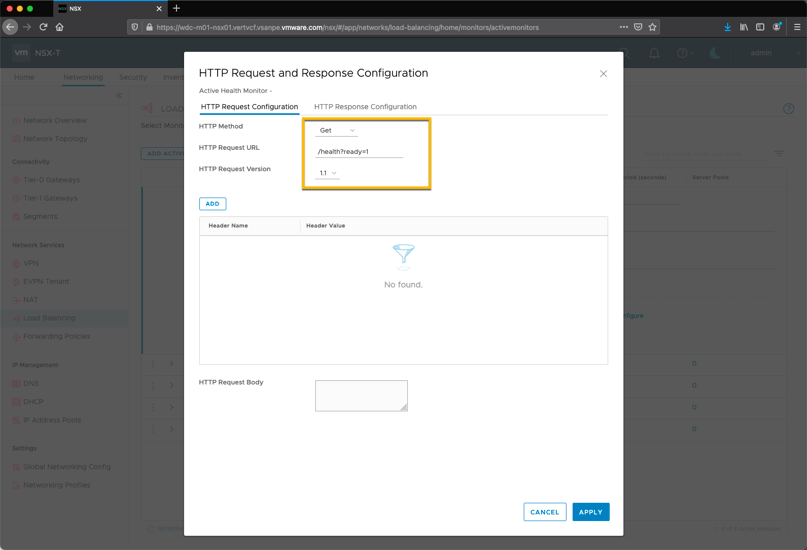
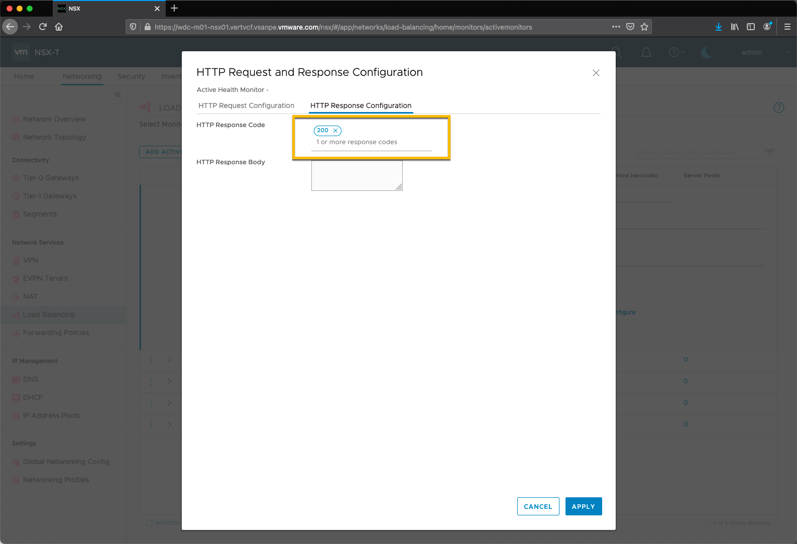
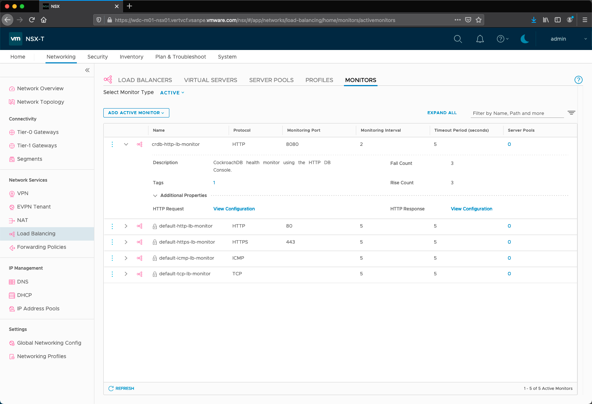

# NSX-T HTTP Monitor for CockroachDB

1. Log into NSX-T and navigate **Networking > Load Balancing > Monitors**

 
2. Click **Add Active Monitor > HTTP**
   

3. Fill in the following fields then click **HTTP Request Configure**.

| Field               | Value                | 
| :---                | :----                |   
| Name                | crdb-http-lb-monitor | 
| Monitoring Port     | 8080                 |
| Monitoring Interval | 2                    |
| Timeout Period      | 5                    |
| Tag                 | CockroachDB          |

4. On the HTTP Request Configuration tab fill in the following fields.

| Field                | Value           | 
| :---                 | :----           |   
| HTTP Method          | Get             | 
| HTTP Request URL     | /health?ready=1 |
| HTTP Request Version | 1.1             |

5. On the HTTP Response Configuration tab fill in the following fields.

| Field                | Value           | 
| :---                 | :----           |   
| HTTP Response Code   | 200             |

6. The completed monitor should look like this.

| Field                | Value           | 
| :---                 | :----           |   
| HTTP Response Code   | 200             |

   