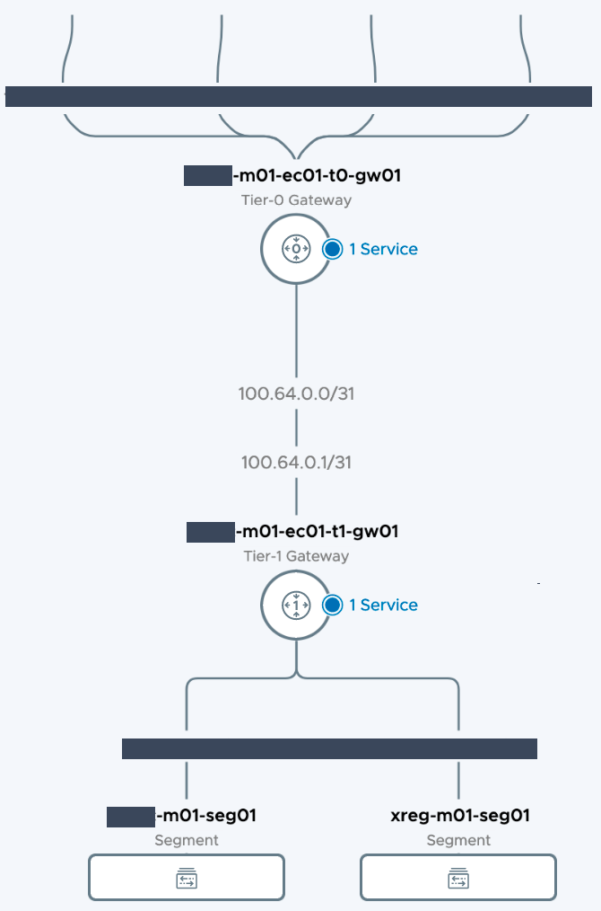
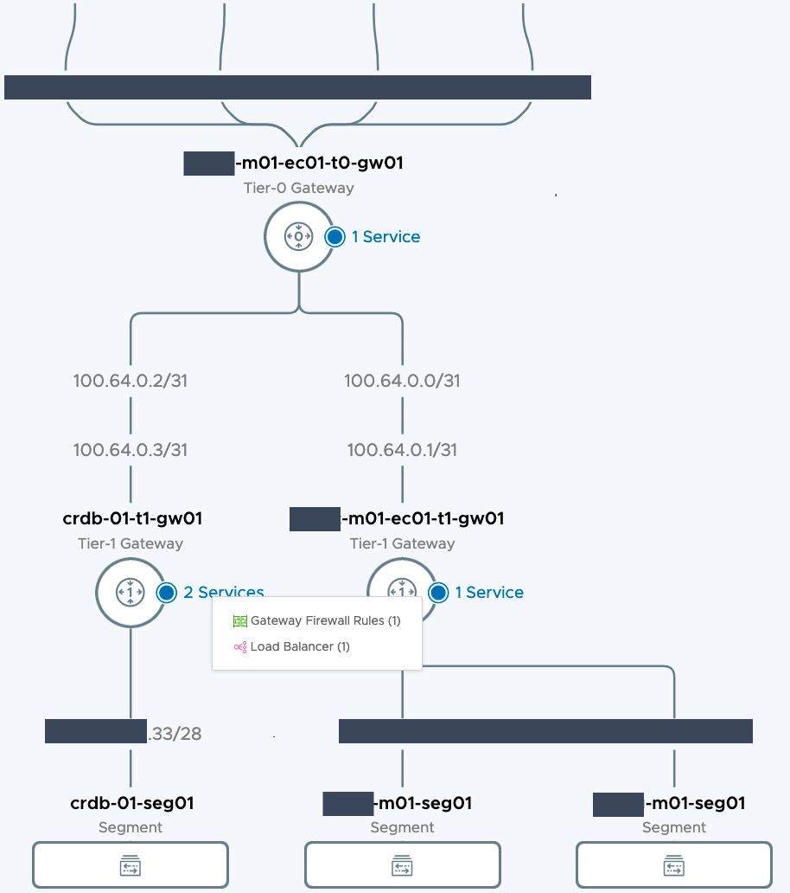
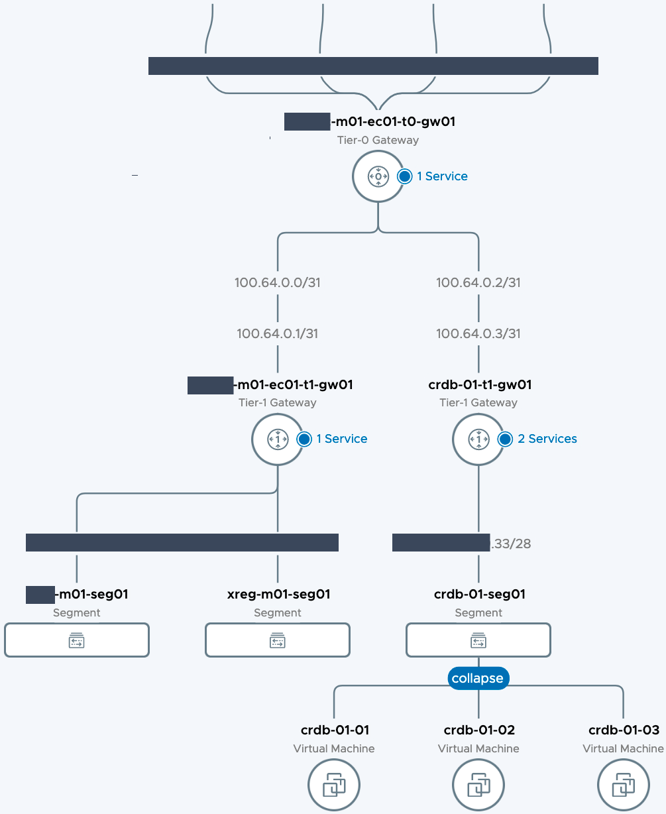

# Cockroach DB NSX-T Load Balancing

Terraform project to set up NSX-T Load Balancing for CockroachDB.

## Prerequisites

* Terraform v0.13+
* NSX-T 3.1+

## Initial Setup

This configured the linux system used to invoke Terraform and create the environment.

### Install requirements.
 ```
 sudo yum -y install git wget unzip
 ```

### Install Terraform
 ```
 # Create binary folder
 mkdir ${HOME}/bin

 # Download the latest stable terraform package
 wget `curl -sL https://releases.hashicorp.com/terraform/index.json | jq -r '.versions[].builds[].url' | egrep 'terraform_[0-9]\.[0-9]{1,2}\.[0-9]{1,2}_linux.*amd64' | sort -V | tail -1` -O /tmp/terraform.zip

 # Extract
 ${HOME}/bin && unzip /tmp/terraform.zip

 # Remove zip file
 rm -f /tmp/terraform.zip

 # Add to path
 if [[ -z $(grep 'export PATH=${HOME}/bin:${PATH}' ~/.bashrc) ]]; then
   echo 'export PATH=${HOME}/bin:${PATH}' >> ~/.bashrc
    source ~/.bashrc
 fi
 
 # Print version
 echo "Installed: `${HOME}/bin/terraform version`"
 ```

### Clone git repository
 ```
 # Change to home directory
 cd ~

 # Clone git repository
 git clone https://github.com/cleeistaken/automation-cockroach-nsxt-lb.git
 ```

## Deployment

### Create an HTTP monitor
   
As of version 3.1.1 the Terraform NSX-T provider can import a monitor but 
lacks the functionality to create. The active HTTP monitor will need to
be manually created.

[Create a NSX-T HTTP monitor](HTTP_MONITOR.md).

Ref. 
 * https://registry.terraform.io/providers/vmware/nsxt/latest
 * https://github.com/vmware/terraform-provider-nsxt

### Initialize Terraform
```
# Change to Terraform folder
cd ~/automation-cockroach-nsxt-lb/cockroach/terraform/

# Initialize
terraform init

# Create a variables file
cp terraform.tfvars.sample terraform .tfvars 
```

### Configure the environment
Edit terraform.tfvars and update the following mandatory fields.

**NSX-T Manager**
* nsxt_manager 
* nsxt_user
* nsxt_password 
* nsxt_insecure_ssl
  
**Environment**
* nsxt_policy_transport_zone
* nsxt_policy_tier0_gateway
* nsxt_policy_edge_cluster
* nsxt_segment_1_cidr
* nsxt_policy_lb_virtual_server_ip
* nsxt_policy_lb_monitor_active_name (the name of the monitor created in step4)

### Deploy NSX-T Load Balancer
```
terraform apply
```

## Validation

### Network Topology Before


### Network Topology After


### Network Topology After
Network diagram with the CocroachDB nodes deployed.
